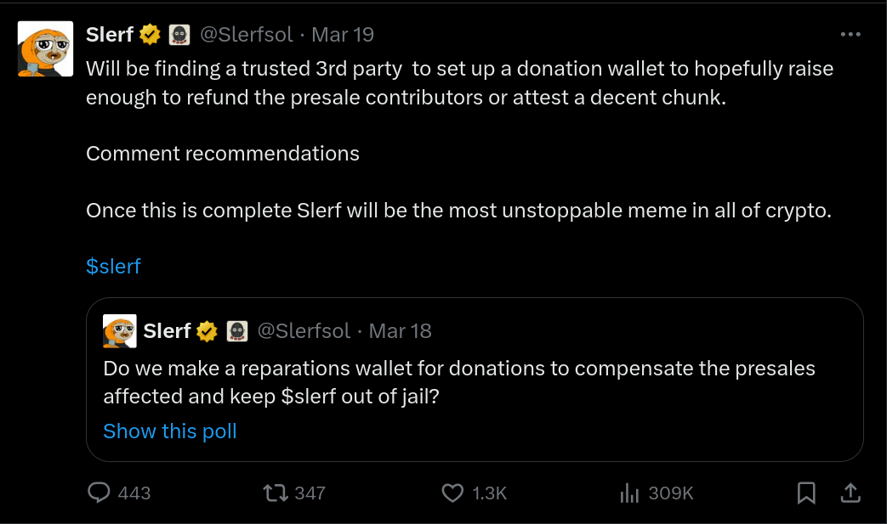
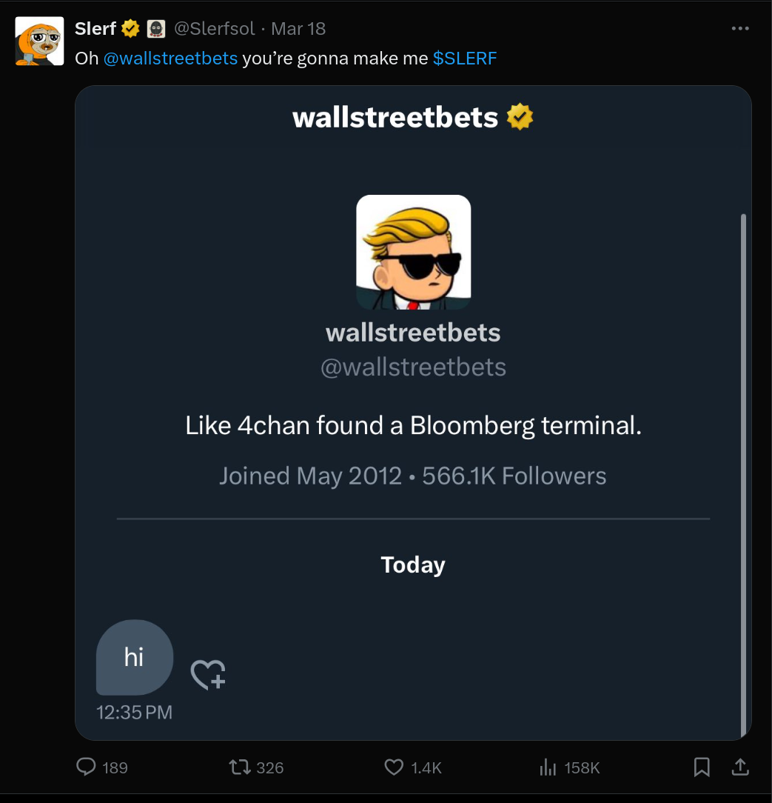

# The Slerf Saga

The Slerf Saga unfolded dramatically over the course of a few days in March 2024, capturing the cryptocurrency community's attention with a series of events that could rival any fictional thriller. It started with the creation of a presale for a new digital token, $SLERF, by @slerfsol, which quickly raised $10 million, showcasing the high interest and speculative fervor within the crypto space. The presale success led to the creation of the token and the launch of a website, setting the stage for what many hoped would be the next big thing in the world of decentralized finance (DeFi).

However, the narrative took a sharp turn when, in an attempt to burn unwanted tokens, the creator accidentally destroyed 500 million $SLERF tokens, a move that drastically reduced the available supply and inadvertently increased the token's value due to the sudden scarcity. This incident was announced through an infamous "oh fuck" tweet, which was followed by a flurry of explanations and apologies from @slerfsol. Despite this mistake, the community rallied around the project, discussing ways to help and mitigate the damage done to presale investors.

In the aftermath of the accidental burn, $SLERF's price began to surge as the market reacted to the reduced supply. This turn of events led to major exchanges announcing plans to list the $SLERF token, further fueling its unexpected rise. As the saga continued, @slerfsol engaged with the community through Twitter Spaces, attempting to navigate the project through its tumultuous start. Despite the setbacks, the token achieved a significant trading volume, with various cryptocurrency platforms and influencers rallying to support the project through donations and public endorsements.

The Slerf Saga is emblematic of the volatile and unpredictable nature of the cryptocurrency market, where fortunes can be made and lost overnight, and community support can play a critical role in a project's survival. It highlights the technical risks associated with digital asset management, the importance of transparency and communication in crisis situations, and the unyielding enthusiasm of the crypto community to support innovative, albeit risky, ventures.

The series of events surrounding the Slerf Saga, from its explosive start to the community's response to setbacks, underscores the speculative dynamics of the crypto market and the collective efforts to navigate its uncertainties. It remains a cautionary tale about the importance of diligence and the potential for recovery through community support in the fast-paced world of cryptocurrency.

## Cornerstone

| Events & Info | Link |
| --- | --- |
| **Presale Wallet** | [HdENn8wP6srk1AuE2CaJj6bRbjcU2kYs12H4C4HgNAsF](https://solscan.io/account/HdENn8wP6srk1AuE2CaJj6bRbjcU2kYs12H4C4HgNAsF) | 
| **Contract Address** | [7BgBvyjrZX1YKz4oh9mjb8ZScatkkwb8DzFx7LoiVkM3](https://solscan.io/token/7BgBvyjrZX1YKz4oh9mjb8ZScatkkwb8DzFx7LoiVkM3) |
| **LP Token Burn** | [Tweet](https://x.com/Slerfsol/status/1769620303229952445?s=20) & [Transaction](https://solscan.io/tx/FFe9R9AfNx7B5vSHGABNSD32mMpynPA7sxF8PpEWDPwmP341jnpQ3ax8TJUXu3xCwvkEKJ9kcrdWz5QZBE8u9fT) |
| **"oh fuck"** | [Tweet](https://x.com/Slerfsol/status/1769626097216315881?s=20) & [Transaction](https://solscan.io/tx/hzVc7DevXGi3DKEyrR23PVV6DRmpA1LgnwUeQkNjnm42tQ7rGipATsLuuSnEaKVbDahWJnwbm2ZGWEF4CTwaBMG) |
| **Donation Wallet Address** | [fCuw5ppJ9aZYzjm8EsT2fHwxV1h5JwUfqXM44iX3Pzb](https://www.lbank.com/slerf-donation) |

## Branding

Get your blank from here to make your own PFP! Thanks to [@HodlerPete](https://x.com/HodlerPete/status/1770494442887155974?s=20). Give him a follow!

| Slerf Blank      |  | 
| --- | --- |
| Full Transparent |  | 

# Timeline of the Slerf Saga

`[WIP]`

## March 16-17

### @slerfsol created a degen presale, collecting SOL from people on Twitter, around 16-17 March 2024.

https://x.com/Slerfsol/status/1769153630244925721?s=20

https://x.com/Slerfsol/status/1769037925751079391?s=20

https://x.com/Slerfsol/status/1769233867460739156?s=20

### 7.5 million $ is raised very quickly.

https://x.com/Slerfsol/status/1769332322849951768?s=20

### And the 10 million $ milestone reached in no time.

https://x.com/Slerfsol/status/1769345327696330832?s=20

### Website launched

https://x.com/Slerfsol/status/1769421177615716366?s=20

### Token is created

https://x.com/Slerfsol/status/1769441083845398707?s=20

**Token address:** https://solscan.io/token/7BgBvyjrZX1YKz4oh9mjb8ZScatkkwb8DzFx7LoiVkM3

**Contract Address:** `7BgBvyjrZX1YKz4oh9mjb8ZScatkkwb8DzFx7LoiVkM3`

### $SLERF predictions :))

https://x.com/Slerfsol/status/1769463309999247442?s=20

## March 18

### LP tokens burned:

https://x.com/Slerfsol/status/1769620303229952445?s=20

**Transaction:** https://solscan.io/tx/FFe9R9AfNx7B5vSHGABNSD32mMpynPA7sxF8PpEWDPwmP341jnpQ3ax8TJUXu3xCwvkEKJ9kcrdWz5QZBE8u9fT

### Token Distribution

@slerfsol decided, for security reasons, to send presale $SLERF tokens in batches to the dev who will distribute them to the presales. While trying to do this, he had issues and decided first to burn the shit tokens people have sent to him. He used https://solanatools.vercel.app/ and https://sol-incinerator.com/ to do that.

# oh fuck

While incinerating the shit tokens in his wallet, he accidentally included the 500 million $SLERF tokens and burned them all, without realizing what he did. 

Someone messaged him why he burned all his tokens and he said I didn’t. Then checked the chain and realized what he did. And tweeted the infamous “oh fuck” tweet:

https://x.com/Slerfsol/status/1769626097216315881?s=20

**Burning of 500 million $SLERF**

https://solscan.io/tx/hzVc7DevXGi3DKEyrR23PVV6DRmpA1LgnwUeQkNjnm42tQ7rGipATsLuuSnEaKVbDahWJnwbm2ZGWEF4CTwaBMG

He then tweeted explaining what he did, how he fucked up. 

https://x.com/Slerfsol/status/1769628588809031864?s=20

He quickly spinned up a Twitter Space and start to talk to people. In the first spaces, the voice of @slerfsol was telling you that this guy was telling the truth. People believed him and started to discuss ways of helping him. I was in most of those spaces.

Topics were; what can be done to repair the damage done to the presalers, what should @slerfsol do legally. Reaching out to the exchanges and creating a donation wallet were talked in this first spaces. As far as I know these first spaces were not recorded as recommended by some attendants. 

### $SLERF starts its journey

When people realized what this means, the price of the token started to pump fast. There were no team tokens, no presale tokens to dump it. All of the supply was in the liquidity pool. 

### Bitget & LBANK were first ones to announce that they will list $SLERF

https://x.com/bitgetglobal/status/1769665051965751740?s=20

https://x.com/LBank_Exchange/status/1769658248934875400?s=20

### My phone died

@slerfsol’s phone not charging become a meme at some point. During the spaces, @slerfsol's phone was not charging and this became a short-lived meme quickly. @slerfsol kept holding spaces throughout the events below.

https://x.com/Slerfsol/status/1769708563029467250?s=20

### HTX Listed $SLERF
https://x.com/HTX_Global/status/1769697067838877713?s=20

### Slerf is werf [SPACE]

113K people tuned in to one of the spaces

https://x.com/Slerfsol/status/1769710069581512822?s=20

### $1.7+ billion Volume

Volume quickly climbed to $1.7 billion, despite the major fuck up.

https://x.com/CoinDesk/status/1769733337914957935?s=20

https://x.com/Slerfsol/status/1769777864834998471?s=20

### Donation Poll

@slerfsol decided to create a poll to ask people if it they want the creation of a donation wallet and Slerf out of jail.

https://x.com/Slerfsol/status/1769774801000751265?s=20

And people started to offer help:

### @wallstreetbets reached out to @slerfsol

https://x.com/Slerfsol/status/1769784593291280674?s=20

### Gate.io Listed $SLERF

https://x.com/gate_io/status/1769669014932845050?s=20

## March 19

### $SLERF enabled Raydium to reach more volume then Uniswap

https://x.com/Slerfsol/status/1769846965074833434?s=20

### $SLERF passed ETH for on-chain volume

https://x.com/Slerfsol/status/1769863501357424702?s=20

### LBANK is announced as custodian for the donation wallet

https://x.com/Slerfsol/status/1769916171392839938?s=20

### $SLERF Let's make history series

$SLERF Let’s make history space series started. The part 2 of series gad Justin Sun, HTX and wallstreetbets and more.

https://x.com/Slerfsol/status/1769917306644070747?s=20

### Exchanges started to announce their support for the donation campaign

https://x.com/LBank_Exchange/status/1769918019738976697?s=20

### @beeple tweeted about $SLERF

https://x.com/beeple/status/1769936439930720685?s=20

### $SLERF become the second highest on-chain volume across all chains

https://x.com/DegenerateNews/status/1769960142349480362?s=20

### BingX announced support for the donation campaign. 

Pledging to donate all trading fees generated from $SLERF spot trades.

https://x.com/Slerfsol/status/1769964506770207169?s=20

### LBANK announced the donation wallet

https://x.com/LBank_Exchange/status/1769946820753740195?s=20

https://x.com/EH_LBank/status/1770016100639547694?s=20

**Donation Wallet:** https://solscan.io/account/fCuw5ppJ9aZYzjm8EsT2fHwxV1h5JwUfqXM44iX3Pzb

### More exchanges announced support for donation wallet:

**Hawksight:** https://x.com/HawksightCo/status/1770011072361308487?s=20
**OneDex:** https://x.com/OneDex_X/status/1770094063112384699?s=20
**Jupiter:** https://x.com/weremeow/status/1769947781463241185?s=20

### LBANK Donation Website went live

**Donation Site:** https://www.lbank.com/slerf-donation

https://x.com/Slerfsol/status/1770150583980183724?s=20

## March 20

### Some guy was repaying presalers in Turkish Telegram channel of Slerf

https://twitter.com/0xYZVR/status/1770571364195324051

## March 21

### Bitget commitment of trading fees

Bitget announced their commitment to donating trading fees and also released their 3-day fee chart.

https://twitter.com/GracyBitget/status/1770721437000540417

### Soul-Bound NFTs

@slerfsol announced that they are planning doing [soul-bound NFTs](https://opensea.io/learn/nft/what-are-soulbound-tokens#:~:text=A%20soulbound%20token%20(SBT)%2C,affiliations%2C%20achievements%2C%20or%20memberships.) for presalers and also for donators.

https://x.com/Slerfsol/status/1770781114325405820?s=20

## TO BE CONTINUED...

This document is work-in-progress and it's being updated regularly.

### @slerfsol continued to hold Twitter Spaces throughout the whole journey and is still doing it...
